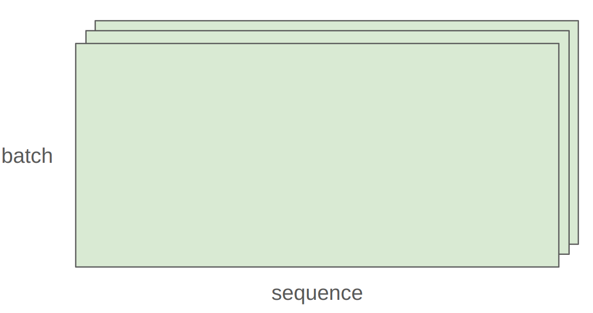

# pytorch与资源核算

**核心目标：**、

1. 机制：掌握Pytorch的基础操作（自底向上：张量->构建模型->优化器->训练循环）
2. 思维模型：养成资源核算的习惯，清楚每一行代码消耗了多少内存和算力
3. 直觉：理解为什么大模型需要特定的硬件和算法优化


### 3.1为什么需要资源核算（资源消耗直接转化为时间和成本）

#### 3.1.1场景一：时间估算

**问题：** 假设你是一个 AI 工程师，老板问你：“在 1024 张 H100 显卡上，训练一个 70B（700亿参数）的模型，数据量是 15T（15万亿 tokens），大概要多久？”

学会“Napkin math”（餐巾纸计算，即**快速估算**）

**第一步：计算总工作量**

FLOPs是衡量计算复杂度的常用指标，表示一个算法或模型在执行过程中所需的浮点加减乘除等运算的总次数。而训练模型本质上是进行浮点运算。有一个经验公式：
$$
总计算量\approx 6*参数量*Token数量
$$
原理：前向传播计算一次约为2*参数量(乘法+加法)，反向传播计算梯度约为前向传播的2倍工作量，即4倍参数量

**第二步：计算硬件算力**

H100的FP16/BF16的峰值算力约为1979 TFLOPS（每秒万亿次浮点运算）

**注意：**此值为NVIDIA H100 GPU在使用FP16或BF16数据类型，且启用结构化稀疏时可达到的理论最大计算吞吐量

对于计算普通的稠密模型，理论峰值减半，约990 TFLOPS

**补：**结构化稀疏是一种模型的压缩方法，通常是对稠密模型按照50%的稀疏度进行剪枝（稀疏形式为n：m，即m个连续权重中必须剪掉n个，类型有2：4、4：8、8：16）。还有一种灵活度更高的非结构化剪枝方法，可以按照百分比进行剪枝，但通常相对于结构化剪枝性能更差

同时，实际运行模型时，由于各种软硬件开销，几乎不可能达到100%**模型算力利用率**，通常按照30%到60%的利用率估算更现实（采用50%用作后续估计）

- 单卡实际算力约等于理论算力乘以0.5
- 总算力=单卡实际算力*卡数量

**第三步：得出结果**
$$
时间=\frac{总工作量}{总算力}
$$

#### 3.1.2 场景二：内存估算

**问题：** 在 8 张 H100 GPU 上，使用 AdamW 优化器（朴素实现，即所有数据都用 float32 存储，没有混合精度或压缩），你能训练的最大模型参数量是多少？

8张H100（每张80GB显存），显存总共640GB。参数采用float32存储，一个参数4字节

同时需要注意训练时显存里存的不只是参数，还有：

- 梯度：和参数大小一样大，需要4字节
- 优化器状态：比如常见的AdamW优化器，需要存储每个参数的一阶矩估计（梯度的指数移动平均）和二阶矩估计（梯度平方的指数移动平均）

因此，每个参数在训练时大概占用16字节

- 参数（FP32）：4 bytes
- 梯度（FP32）：4 bytes
- 优化器状态（FP32）：8 bytes（2个变量 * 4 bytes）

$$
最大参数量=\frac{所有显卡总显存大小}{每个参数训练实际占用字节}
$$

**注意：**此估算较为粗略，因为它未考虑依赖于批次大小和序列长度的激活值内存占用，所以如果不考虑混合精度或压缩，实际能训练的模型可能会更小


## 3.2张量（Tensors）

### 3.2.1张量基础

深度学习中，张量是存储一切的基础数据结构：模型参数、梯度、优化器状态、输入数据、中间激活值等都以张量形式存在

```python
#多种创建张量的方法
x=torch.tensor([[1,2,3],[4,5,6]])#从python列表创建
x=torch.zeros(4,8) #4x8的零矩阵
x=torch.ones(4,8) #4x8的全1矩阵
x=torch.randn(4,8)#4x8的正态分布随机数

#分配但不初始化值（用于自定义初始化的值）
x=torch,empty(4,8)#未初始化的4x8矩阵
nn.init.trunc_normal_(x,mean=0,std=1.a=-2,b=2) #截断正态分布初始化、分布均值为0
```

### 3.2.2张量的操作

大多数张量都是通过对其他张量执行操作来创建的，每个操作都会占用一定的内存和计算资源

**张量视图（view）**

许多操作只是提供张量的一个不同“视图”。这不会创建副本，因此在一个张量中的修改回影响另一个

```python
x=torch.tensor([[1,2,3],[4,5,6]])
#这些操作不复制数据
y=x[0]   #获取第0行
y=x[:,1] #获取第1列
y=x.view(3,2) #重塑为3x2
y=x.transpose(1,0) #转置

#验证是否共享存储
assert same_storage(x,y) #same_storage检查底层存储是否相同

#注意：修改x会影响y
```

**注意：**并非所有视图都是“连续”的。当一个视图的数据在内存中不是按顺序存储时，它就是非连续的

转置后的张量是非连续的：

```python
x = torch.tensor([[1., 2, 3], [4, 5, 6]])
y = x.transpose(1, 0)
assert not y.is_contiguous()  # 非连续张量
```

不能对非连续张量直接执行某些操作，比如再次view：

```python
# 尝试重塑会失败
try:
    y.view(2, 3)
except RuntimeError as e:
    assert "view size is not compatible with input tensor's size and stride" in str(e)
```

如果对一个非连续张量进行进一步操作，可以先调用.contiguous()方法：

```python
#解决方案，先使张量连续
y=x.transpose(1,0).contiguous().view(2,3)
assert not same_storage(x,y) #现在创建了新存储
```

**注：**.contiguous()会创建一个新的张量，并将数据按顺序复制到新的连续内存块中，这样后续操作就不会出错


#### 逐元素操作（Element-wise Operations）

逐元素操作是对每个元素独立应用函数，并返回相同形状的新张量。这意味着，当你对一个张量执行x .pow(2)或x+x时，操作会独立地作用于张量中的每一个数字，而不会像矩阵乘法那样考虑元素之间的行列关系

```python
x = torch.tensor([1, 4, 9])
assert torch.equal(x.pow(2), torch.tensor([1, 16, 81]))    # 幂运算 (pow)，每个元素平方
assert torch.equal(x.sqrt(), torch.tensor([1, 2, 3]))      # 对每个元素开平方根
assert torch.equal(x.rsqrt(), torch.tensor([1, 1/2, 1/3])) # rsqrt 是 reciprocal of sqrt 的缩写，即对每个元素先开方再取倒数
```

基本的逐元素算术运算：

```python
assert torch.equal(x + x, torch.tensor([2, 8, 18])) # 每个元素自加
assert torch.equal(x * 2, torch.tensor([2, 8, 18])) # 每个元素乘以标量2
assert torch.equal(x / 0.5, torch.tensor([2, 8, 18])) # 每个元素除以标量0.5
```

最后，引入一个工具函数triu，计算**因果注意力掩码（causal attention mask）**时非常有用。在语言模型中，为了确保模型在预测第 j 个词时只能看到第 j 个词之前的词（即不能“偷看”未来信息），就需要使用这种上三角矩阵作为掩码。其中 M[i, j] 表示位置 i 对位置 j 的贡献，当 i > j 时（即 i 在 j 之后），贡献应为0。

```python
#实用操作：上三角矩阵（用于因果注意力掩码）
x=torch.ones(3,3).triu() #创建一个3x3全1矩阵，然后取其上三角部分
#结果
# [[1, 1, 1],
#  [0, 1, 1],
#  [0, 0, 1]]
```


#### 矩阵乘法

矩阵乘法是深度学习的基础。

标准的矩阵乘法形式为：一个M x K的矩阵乘以一个 K x N的矩阵，得到一个 MxN 的结果矩阵。示例如下：

```python
#基本矩阵乘法
x=torch.ones(16,32) #16x32矩阵
w=torch.ones(32,2)  #32x2权重矩阵
y=x@w #结果：16x2矩阵
assert y.size()==torch.Size([16,2])
```

在实际应用中，很少只处理单个数据样本。为了提高效率，会将多个样本打包成一个“批次（batch）”，并对整个批次同时进行计算。



- batch 标签指向堆叠起来的多个矩形，代表一个批次中包含的多个样本
- sequence标签指向每个矩形内部，代表每个样本可能包含的序列长度（例如：一个句子中的词元数量）

对前两个维度（批次和序列中的每个样本执行矩阵乘法）

```python
x=torch.ones(4,8,16,32) #形状为[批大小，序列长度，样本特征，特征维度]
w=torch.ones(32,2) #权重矩阵
y=x@w   #矩阵乘法
assert y.size()==torch.Size([4,8,16,2])#结果形状
```

在PyTorch进行上述运算时，会自动遍历x的前两个维度（即4和8），对每一个16x32的子矩阵执行与w的矩阵乘法，最后y的形状（4，8，16，2），其中前两个维度保持不变，后两个维度根据矩阵乘法规则变化

#### 3.2.3 使用Einops库对张量操作进行优化

在pytorch中，张量维度通常是[batch,sequence,hidden]。用PyTorch原生的.view()和transpose（）操作维度时，需要时刻记住张量的维度顺序，很容易搞晕。并且，若未来修改了张量形状（比如在transformers模型中加了heads维度），代码就可能出错

```python
x = torch.ones(2, 2, 3)  # batch, sequence, hidden
y = torch.ones(2, 2, 3)  # batch, sequence, hidden
z = x @ y.transpose(-2, -1)  # 得到 (batch, sequence, sequence)
```

解决这个问题 ：（**使用jaxtyping先声明维度含义，再使用einops来操作张量**）

1. 用jaxtyping命名维度

   ```python
   #jaxtyping方式（在类型注解中命名维度）
   from jaxtyping import Float
   x: Float[torch.Tensor,"batch seq heads hidden"]=torch.ones(2,2,1,3)
   ```

   `jaxtyping` 提供的维度命名（如 "batch seq hidden"）在当前 PyTorch 生态中主要是“文档性质”的，不会在运行时自动强制检查维度是否真的匹配名称，但它能极大地提升代码的清晰度和可靠性。也就是说PyTorch 在运行时不会检查 x 的形状是否真的是 (batch=2, seq=3, hidden=4)

   尽管不强制校验，jaxtyping 仍带来巨大工程价值，当你将来修改模型（比如增加 heads 维度）：

   - 类型注解会提醒你哪里需要同步更新。
   - IDE（如 VS Code、PyCharm）能基于注解提供：
     - 自动补全
     - 重构支持（rename dimension）
     - 错误高亮（如果你在 einsum 中拼错了维度名）

2. 用einops.einsum替代矩阵乘法+转置

   广义矩阵乘法，具有清晰的维度跟踪：

   ```python
   from einops import einsum
   
   #定义两个张量
   x:Float[torch.Tensor,"batch seq1 hidden"]=torch.ones(2,3,4)
   y:Float[torch.Tensor,"batch seq2 hidden"]=torch.ones(2,3,4)
   
   #Einops 方式
   z=einsum(x,y,"batch seq1 hidden,batch seq2 hidden->batch seq1 seq2")
   #未在输出中命名的维度（hidden）会被自动求和
   ```

   这种方法会将没在输出中出现的 hidden 维度，自动对该维度做求和。这本质上是爱因斯坦求和约定（Einstein summation） 的直观实现。更通用的写法是（支持任意前导维度）：

   ```python
   z=einsum(x,y,"...seq1 hidden, ... seq2 hidden -> ... seq1 seq2")
   ```

   `...` 表示“任意数量的前导维度”，比如可能是 (device, batch) 或 (ensemble, batch, time)，代码依然适用。好处是维度逻辑显式、通用、不易出错，且天然支持广播。

3. 用einops.reduce替代mean(dim=...)

   ```python
   from einops import reduce
   
   x:Float[torch.Tensor,"batch seq hidden"]=torch.ones(2,3,4)
   
   #传统写法
   y=x.mean(dim=1) #对最后一个维度hidden上求平均
   
   #Einops写法
   y=reduce(x,"...hidden->...","mean")
   ```

   从 `... hidden` 变成 `...`，说明 hidden 维度被“聚合”了，聚合方式是 `"mean"`（也可用 `"sum"`, `"max"` 等）。 同样`...` 表示“任意数量的前导维度”。这种写法的好处是明确表达了“我打算把哪个维度压缩掉”，语义清晰。

4. 用einops.rearrange 拆分合并维度

   这是Einops最强大的功能之一，用于处理扁平化与重组

   假设：一个维度total_hidden=8，实际上是heads=2和 hidden1=4的乘积（即2*4=8），也就是total_hidden维度实际上是heads x hidden1的扁平化表示

   ```python
   from einops import rearrange
   
   # 情景：hidden维度实际上是heads×hidden1的扁平化表示
   x: Float[torch.Tensor, "batch seq total_hidden"] = torch.ones(2, 3, 8)
   w: Float[torch.Tensor, "hidden1 hidden2"] = torch.ones(4, 4)
   ```

   现在想对hidden1做矩阵乘法，但当前维度是扁平的，需要对其进行**维度拆分**（flatten->multi-dim）:

   ```python
   #拆分 total_hidden 为 heads 和 hidden1
   x=rearrange(x,"...(heads hidden1)->heads hidden1",heads=2)
   ```

   （heads hidden1）表示“这两个维度被乘在一起，现在我要拆开它”。因为 8 可以拆成 (2,4), (4,2), (8,1) 等，所以必须指定 heads=2 用来固定拆分后的维度。

   接下来，对拆分后的维度做矩阵乘法：

   ```python
   x=einsum(x,w,"...hidden1,hidden1 hiddne2->...hidden2")
   ```

   最后，进行**维度合并（multi-dim->flatten）**的操作

   ```python
   #合并维度
   x=rearrange(x,"...heads hidden2->...(heads hidden2)")
   ```

   尽管Einops增加了少量语法开销，但其清晰的维度命名显著降低了调试难度，特别是在复杂的模型架构中


## 3.3内存（Memory）

张量的内存占用由两个因素决定：

- 元素数量：张量的形状（如4x8矩阵有32个元素）
- 数据类型：每个元素占用的字节数


### 3.3.1浮点类型

在 LLM 训练中，选择数据类型本质上是在做显存占用、计算速度与数值稳定性之间的权衡（Trade-off）。我们关注的大多数张量（参数、梯度、激活值、优化器状态）都以浮点数形式进行存储，让我们深入理解不同的浮点数据类型：

1. Float32 (FP32 / 单精度浮点数)

[](https://raw.githubusercontent.com/datawhalechina/diy-llm/main/docs/chapter3/images/3-5-fp32.png)

图3.5 单精度浮点数

- **规格**：占用 **4 字节** (32 bits)。结构为：1位符号位 + **8位指数位** + 23位尾数位。
- **地位**：PyTorch 的默认数据类型，也是科学计算领域的“黄金标准”。
- **优点**：数值精度高，动态范围大，训练最稳定，几乎不会出现数值溢出问题。
- **缺点**：对于大模型而言太“奢侈”。它占用的显存是 16位格式的两倍，且在现代 GPU（如 H100）上的计算吞吐量远低于低精度格式。
- **炼丹用途**：通常用于存储**参数的主副本 (Master Weights)** 和 **优化器状态 (Optimizer States)**，以确保在梯度累积和参数更新时不会因为精度丢失而导致模型无法收敛。

1. Float16 (FP16 / 半精度浮点数)

[](https://raw.githubusercontent.com/datawhalechina/diy-llm/main/docs/chapter3/images/3-6-fp16.png)

图3.6 半精度浮点数

- **规格**：占用 **2 字节** (16 bits)。结构为：1位符号位 + **5位指数位** + 10位尾数位。

- **优点**：显存占用比 FP32 减少一半，计算速度快。

- 致命缺陷

  ：

  动态范围（Dynamic Range）太窄

  。

  - 由于指数位只有 5 位，它无法表示非常小的数（会发生下溢 Underflow，直接变成 0）或非常大的数（会发生上溢 Overflow，变成 Infinity）。
  - 例如：在 FP16 中，`1e-8` 这样的小数会被直接当作 `0` 处理，导致梯度消失。

- **用途**：这是上一代 GPU（如 V100）混合精度训练的主流。为了解决溢出问题，必须使用复杂的**损失缩放 (Loss Scaling)** 技术。目前在 LLM 训练中正逐渐被 BF16 取代。

1. BFloat16 (BF16 / Brain Floating Point)

[](https://raw.githubusercontent.com/datawhalechina/diy-llm/main/docs/chapter3/images/3-7-bf16.png)

图3.7 BF16

- **规格**：占用 **2 字节** (16 bits)。结构为：1位符号位 + **8位指数位** + 7位尾数位。

- **来源**：由 Google Brain 专为深度学习设计。

- 设计逻辑

  ：

  “要范围，不要精度”

  。

  - 深度学习模型（尤其是神经网络）对小数点的后几位精度不敏感，但对数值的范围非常敏感。
  - BF16 直接截断了 FP32 的尾数，但**保留了和 FP32 相同的 8 位指数位**。

- 优点

  ：

  - 拥有和 FP32 一样宽广的动态范围，**不需要 Loss Scaling** 也能稳定训练。
  - 显存占用和 FP16 一样少。
  - 在 A100/H100 等新硬件上计算速度极快。

- **用途**：**当前 LLM 训练的绝对主流选择**。通常用于存储**激活值 (Activations)** 以及进行前向和反向传播的矩阵乘法计算。

1. FP8 (8位浮点数)

[](https://raw.githubusercontent.com/datawhalechina/diy-llm/main/docs/chapter3/images/3-8-fp8.png)

图3.8 8位浮点数

- **规格**：占用 **1 字节** (8 bits)。

- 变体

  ：

  - **E4M3**：4位指数，3位尾数（精度稍高，范围稍小）。
  - **E5M2**：5位指数，2位尾数（范围稍大，精度更低）。

- **优点**：极致的显存压缩和计算吞吐量。

- **硬件限制**：仅在 NVIDIA H100 及更新的架构（配合 Transformer Engine）上才被原生支持。

- **炼丹用途**：目前主要用于**推理阶段的量化 (Quantization)**。虽然理论上可以用于训练（H100 支持），但由于精度极低，训练极不稳定，属于比较前沿的研究领域。


**🪜 为什么 BF16 优于 FP16？**

> 在深度学习中，我们通常不关心小数点后第10位的精确度（精度），但非常关心能否表示非常大或非常小的数（动态范围）。FP16 的指数位太少，导致训练中经常出现 `NaN` 或 `0`（下溢）。BF16 截断了 FP32 的尾数，保留了指数位，因此它能表示的数值范围与 FP32 一样大，极大地提升了训练稳定性。


#### 3.3.2张量在内存中的存储机制

当前PyTorch版本中，PyTorch设计者们选择将这一层实现细节进行封装，让Tensor对象本身成为一个集成了“指针+元数据”的单一实体。这意味着一个张量本身并不直接“包含”数据，而是指向一块连续的内存区域，并附带一套规则（元数据），告诉程序图和根据你请求的索引去这块内存里找到对应的数据。

张量在底层可以是按行存储也可以是按列存储。Numpy和Pytorch都采用了按行存储的方式，任何维度的张量在底层存储都占据着内存中的连续空间。

**访问到想要位置的数据：步长**【元组，定义了在每个维度上移动一个单位时，在底层存储中需要“跳过”的元素数量】

```python
#步长（stride）：在每个维度上移动时跳过的元素数
assert x.stride(0)==4 #行维度：移动到下一行需跳过4个元素
assert x.stride(1)==1 #列维度：移动到下一列需跳过1个元素

#计算元素位置：行索引r，列索引c
r,c=1,2
index=r*x.stride(0)+c*x.stride(1) #位置6
```

   Pytorch通过**步长**：将多维张量的逻辑结构映射到一维的物理内存上

**关键点：**很多操作（如 view，transpose，slice）不会复制数据，只是改变了stride（**Zero-copy**）

```python
x=torch.randn(32,32)
y=x.view(1024) #只是改变了看待数据的方式，内存地址没变
z=x.transpose(0,1) #修改了stride,没有复制数据（但由于修改了stride，内存位置不变，导致现在意义上的内存不再连续）
```

**坑点：**若对转置后的张量调用.view()，可能会报错。因为转置后内存不再连续。需要先调用.contiguous()，这会触发数据复制（消耗内存和时间）

### 3.3.3 将张量（tensors）从CPU内存移动到GPU内存

默认情况下，张量存储在CPU内存上

```python
x=torch.zeros(32,32)
assert x.device==torch.device("cpu")
```

但是，为了利用GPU的大规模并行性加速计算，需要将它们移动到GPU内存中


CPU和GPU通过“PCI BUS”（PCI总线）相连，数据在CPU和GPU之间传输需要经过这条总线，这通常是一个性能瓶颈，因为它的带宽远小于GPU内部的内存带宽。因此，在实际应用中，我们应尽量减少CPU和GPU之间的数据传输

在PyTorch中，想要将张量从CPU移动到GPU，需要以下几个步骤：

- 首先，查看机器是否有GPU

  ```python
  if not torch.cuda.is_available():
      return
  ```

- 接下来，获取GPU信息：

  ```python
  num_gpus=torch.cuda.device_count()  #获取GPU数量
  for i in range(num_gpus):
      properties=torch.cuda.get_device_properties(i)  #获取第i块GPU的属性
  memory_allocated=torch.cuda.memory_allocated() #获取当前已分配给PyTorch的显存总量
  ```

- 移动张量到GPU上有两种方法：

  - 方法一：移动现有张量

    ```python
    y=x.to("cuda:0") #将张量x移动到编号为0的GPU上
    assert y.device==torch.device("cuda",0) #验证移动成功
    ```

  - 方法二：直接在GPU上创建张量

    ```python
    z=torch.zeros(32,32,device="cuda:0") #在GPU上直接创建一个32x32的零矩阵
    ```

- 最后验证内存分配

  ```python
  new_memory_allocated=torch.cuda.memory_allocated() #再次查询当前显存占用
  memory_used=new_memory_allocated-memory_allocated #计算新增的显存占用
  assert memory_used==2*(32*32*4) #验证：新增了2个32x32的矩阵，每个元素时4byte的floatt
  ```


## 3.4计算效率

#### 3.4.1浮点运算总数（FLOPs）

概述

一个浮点运算（Floating Point Operation）是一个基本的算数操作，比如加法x+y或乘法x*y，理解FLOPs对性能分析至关重要

- FLOPs：执行的浮点运算总数，这是一个衡量计算量的指标
- FLOP/s：硬件每秒能执行的浮点运算次数，也写作FLOPS，一个衡量“速度”的指标

**线性模型的计算量**

为了具体化FLOPs的计算方法，引入一个简单的线性模型作为例子。这个线性模型有B个数据点，每个点是D维的，模型将其映射到K维输出。要做的核心操作时矩阵乘法y=x@w，目标是计算这个操作总共需要多少次浮点运算（FLOPs）？

```python
if torch.cuda.is_available():
    B=16384 #Number of points
    D=32768 #Dimension
    K=8192  #Number of outputs
else:
    B=1024
    D=256
    K=64
device=get_device()
x=torch.ones(B,D,device=device)
w=torch.randn(D,K,device=device)
y=x@w
```

- x 是输入数据，形状为 (B, D)
- B：batch size（数据点数量）
- D：每个数据点的维度（输入特征数）
- w 是权重矩阵，形状为 (D, K)
- K：输出维度（比如分类任务的类别数）
- y 是输出，形状为 (B, K)

虑 y = x @ w 中的一个输出元素 y[i, k]：

```
y[i, k] = x[i, 0] * w[0, k] +
           x[i, 1] * w[1, k] +
           ...
           x[i, D-1] * w[D-1, k]
```


这个求和过程包含 D 次乘法（x[i, j] * w[j, k]）和 D - 1 次加法，总共 ≈ 2D 次 FLOPs（因为 D 通常很大，D - 1 ≈ D）

因此，矩阵乘法的计算量：**总 FLOPs** ≈2×B×D×K（B x K x 2D，一共有BxK个元素要计算）

同时DxK刚好是这个线性层的参数数量。可以重写为：

$FLOPs = 2 \times 数据量 \times 模型参数量$

在语言模型中，常用token代替数据点：

$FLOPs = 2 \times token 数量 \times 模型参数量$

【注】：虽然相较于线性模型， Transformer 还有注意力、LayerNorm 等额外操作，但矩阵乘法占主导，所以这个公式对 Transformer 也基本成立

**其他操作的 FLOPs**

- 逐元素操作（Element-wise Operations）：对张量中每个元素独立应用某个函数（如 x + 1、x.sqrt()、torch.relu(x) 等）。若张量形状为 m × n，则逐元素操作的 FLOPs 为 O(m × n)。
- 张量加法（Tensor Addition）：两个相同形状张量的对应元素相加，如 z = x + y。若 x 和 y 均为 m × n，则总 FLOPs = m × n（每个元素 1 次加法）。

对比矩阵乘法 A (m×k) @ B (k×n) 的 FLOPs = 2 × m × k × n。当 k 较大时（如 k = 1024），矩阵乘法的 FLOPs 是加法的上千倍。对于现代深度学习模型（尤其是 Transformer、MLP 等），90%+ 的 FLOPs 来自矩阵乘法（线性层、QKV 投影、FFN 等）。其他操作（LayerNorm、Softmax、激活函数、加法残差连接等）虽然存在，但 FLOPs 可忽略不计。因此，**在进行粗略但有效的资源估算时，只需计算所有矩阵乘法的 FLOPs 总和即可**。


#### 3.4.2 MFU（Model FLOPs Utilization）

MFU=（实际FLOP/s）/（硬件峰值FLOP/s），即：
$$
MFU=\frac{实测FLOPS}{硬件理论峰值}
$$

- MFU >= 0.5：被认为是相当不错的性能
- MFU 接近 1.0：非常难达到，因为硬件不可能100%满负荷运转，总会有内存访问、数据传输等开销


#### 3.4.3 PyTorch中的梯度计算

**梯度反向传播**

```python
#以线性模型为例
y=0.5*(x*w-5)^2

#前向传播代码
x=torch.tensor([1.,2,3])#输入数据，不需要计算梯度
w=torch.tensor([1.,1,1],requires_grad=True) #模型参数，需要计算梯度
pred_y=x@w #预测值(矩阵乘法)
loss=0.5*(pred_y-5).pow(2) #计算损失值

#requires_grad=True 这个参数它告诉 PyTorch “请为这个张量 w 构建计算图，并在反向传播时计算它的梯度

#反向传播
loss.backward() #触发反向传播
assert loss.grad is None # 损失值 loss 本身是一个标量，它没有“上游”的梯度，所以它的 .grad 属性是 None
assert pred_y.grad is None # 中间变量 pred_y 默认情况下也不会保存梯度，除非你显式地调用 pred_y.retain_grad()
assert x.grad is None # 因为 x 在创建时没有设置 requires_grad=True，所以它不会被追踪，其 .grad 也为 None
assert torch.equal(w.grad, torch.tensor([1, 2, 3])) # 验证模型参数 w 的梯度是否计算正确

#调用 loss.backward() 后，PyTorch 会从 loss 开始，沿着计算图回溯，自动计算出每个需要梯度的张量的梯度。
```

结论：在深度学习中，**训练一次（前向+反向）的总 FLOPs 约等于 6 倍的“数据点数量 × 参数数量**


## 3.5 模型构建于训练基础

#### 3.5.1参数初始化

**模型参数的存储**

```python
w=nn.Parameter(torch.randn(input_dim,output_dim))
```

nn.Parameter 是 torch.Tensor 的子类，因此它“表现得像一个张量”，可以进行所有张量操作。它有一个 .data 属性，用于访问其底层的 torch.Tensor 数据。

**参数初始化的重要性及常用方法**

```python
#若直接用torch.randn进行标准高斯分布初始化参数，随着层数变深，数值会非常大或非常小
#为了克服这个问题，需要一种对输入维度input_dim不敏感的初始化方法
#解决方法是使用Xavier初始化，通过除以sqrt(输入维度)来缩放权重，保持数值稳定性
w=nn.Parameter(torch.randn(input_dim,output_dim)/np.sqrt(input_dim))

#经过缩放后，输出 output 的每个元素的值变得稳定在一个较小的范围内，不再随 input_dim 增长。

#即使使用了 Xavier 初始化，由于正态分布的尾部是无界的，仍然存在产生极端值（outliers）的可能性。解决方案是使用截断正态分布（truncated normal distribution），将生成的随机数限制在一个合理的范围内（如 [-3, 3]）。
w=nn.Parameter(nn.init.trunc_normal_(torch.empty(input_dim,output_dim),std=1/np.sqrt(input_dim),a=-3,b=3))
```

#### 3.5.2使用pytorch自定义模型

**定义模型结构**

```python
D = 64 # Dimension
num_layers = 2
model = Cruncher(dim=D, num_layers=num_layers)

class Cruncher(nn.Module):
    def __init__(self, dim: int, num_layers: int):
        super().__init__()
        self.layers = nn.ModuleList([
            Linear(dim, dim)
            for i in range(num_layers)
        ])
        self.final = Linear(dim, 1)  # 创建一个最终的 Linear 层，它将 dim 维的特征映射到 1 维的标量输出
    def forward(self, x: torch.Tensor) -> torch.Tensor:
        # Apply linear layers
        B, D = x.size()
        for layer in self.layers:
            x = layer(x)
        # Apply final head
        x = self.final(x)
        assert x.size() == torch.Size([B, 1])
        # Remove the last dimension
        x = x.squeeze(-1) # 移除最后一个维度（即大小为1的那个维度），使得最终输出是一个一维张量 (B,)，更符合我们对“预测值”的直观理解（例如，对每个样本输出一个分数）
        assert x.size() == torch.Size([B])
        return x
    
#linear类实现了神经网络中最基本的构建块——线性层（dense层）
class Linear(nn.Module):
    """Simple linear layer."""
    def __init__(self, input_dim: int, output_dim: int):
        super().__init__()
        self.weight = nn.Parameter(torch.randn(input_dim, output_dim) / np.sqrt(input_dim))
    def forward(self, x: torch.Tensor) -> torch.Tensor:
        return x @ self.weight

#检查模型参数
param_sizes = [
    (name, param.numel())  # param.numel()：返回该参数张量中的元素总数
    for name, param in model.state_dict().items()
]
assert param_sizes == [
    ("layers.0.weight", D * D),
    ("layers.1.weight", D * D),
    ("final.weight", D),
]

#将模型移到GPU
device = get_device()
model = model.to(device)

#在数据上运行模型
B = 8 # Batch size
x = torch.randn(B, D, device=device) #在GPU创建数据，对于其他数据可以移动到GPU上
y = model(x)
assert y.size() == torch.Size([B])
```


#### 3.5.3如何管理随机性（Randomness）以确保结果的可重现性

随机性在深度学习的许多地方都会出现：

- 参数初始化：模型权重通常从随机分布（如正态分布）中采样。
- Dropout：训练时随机“关闭”一部分神经元。
- 数据排序：数据加载器通常会打乱数据顺序。
- 其他：如数据增强、优化器中的动量等。

```python
#解决方法：设置随机种子
#pytorch需要设置随机种子
#numpy需要设置随机种子、
#标准库random需要设置种子
seed=0
torch.manual_seed(seed)
np.random.seed(seed)
random.seed(seed)
```

#### 3.5.4数据加载

在语言建模中，输入数据通常是经过分词器（tokenizer）处理后的整数序列。例如，句子 "Hello world" 可能被编码为 [1, 2]。为了方便处理，这些整数序列通常会被保存为 NumPy 数组文件（.npy 格式）。

```python
orig_data = np.array([1, 2, 3, 4, 5, 6, 7, 8, 9, 10], dtype=np.int32)
orig_data.tofile("data.npy") # 将数组保存到文件
```

对于像 LLaMA 这样高达 2.8TB 的超大数据集，不可能将其全部加载到内存中。解决方案是使用 `numpy.memmap` 创建一个“内存映射”对象。

```python
data = np.memmap("data.npy", dtype=np.int32) # 创建内存映射
assert np.array_equal(data, orig_data) # 验证加载的数据是否正确
```

data 对象本身不包含数据，而是一个指向磁盘上文件的“指针”。当你访问 data[0] 或 data[1:10] 时，系统才会按需将这部分数据从磁盘加载到内存中。这种方式极大地节省了内存占用，允许你在内存有限的情况下处理远超内存大小的数据集。

**注：内存映射通过类指针形式节省了内存**

在实际训练中，我们不会直接操作整个数据集，而是通过一个“数据加载器”来生成训练所需的批次。

```python
B = 2  # 批次大小，即一次训练处理多少个样本
L = 4  # 序列长度，即每个样本包含多少个词元（token）
x = get_batch(data, batch_size=B, sequence_length=L, device=get_device())
assert x.size() == torch.Size([B, L]) # 验证输出张量的形状
```

调用 `get_batch` 函数从 data 中随机采样 B 个起始位置，然后截取每个位置后长度为 L 的序列，最终返回一个形状为 (B, L) 的张量 x

```python
#get_batch()函数的内部处理逻辑
def get_batch(data: np.array, batch_size: int, sequence_length: int, device: str) -> torch.Tensor:
    # 随机采样起始位置
    start_indices = torch.randint(len(data) - sequence_length, (batch_size,)) # 使用 torch.randint 在 [0, len(data) - sequence_length] 范围内随机生成 batch_size 个起始索引。这样可以确保每个序列都能完整地从数据中截取出来，不会越界
    assert start_indices.size() == torch.Size([batch_size]) # 断言验证了生成的索引数量正确

    # 根据起始索引提取数据
    x = torch.tensor([data[start:start + sequence_length] for start in start_indices]) # 遍历 start_indices 中的每一个起始位置 start，从 data 中切片出长度为 sequence_length 的子序列。最后将这些子序列转换成一个 PyTorch 张量 x，其形状为 (batch_size, sequence_length)
    assert x.size() == torch.Size([batch_size, sequence_length])

    # 固定内存（Pinned Memory）优化
    if torch.cuda.is_available():
        x = x.pin_memory()

    # 异步数据传输
    x = x.to(device, non_blocking=True) 
#data: 输入数据，是一个 NumPy 数组，通常是经过分词器处理后的整数序列。
#batch_size: 要采样的批次大小。
#sequence_length: 每个序列的长度。
#device: 目标设备（如 "cuda:0" 或 "cpu"）。
```

**固定内存（Pinned Memory）优化**：默认情况下 CPU 上的张量存储在“分页内存”（paged memory）中。当需要将数据从 CPU 传输到 GPU 时，操作系统必须先将数据复制到一个“非分页”的内存区域，然后再通过 PCIe 总线发送给 GPU。这个过程是同步的，会阻塞当前进程。通过调用 `.pin_memory()`，我们可以将 CPU 张量显式地标记为“固定”，这意味着它的物理内存地址是固定的，不会被操作系统换出到磁盘。这使得 GPU 驱动程序可以直接访问这块内存，无需额外的拷贝步骤。

**异步传输**：设置 non_blocking=True 参数，这告诉 PyTorch 数据传输可以在后台异步进行，不会阻塞当前的 Python 线程

通过结合“固定内存”和“异步传输”，我们可以实现以下高效的流水线操作：

- 在 GPU 上处理当前批次的数据。
- 在 CPU 上同时加载下一个批次的数据（例如，从硬盘读取或从内存映射文件中加载）。

这种并行化可以显著减少 GPU 的空闲等待时间，从而大幅提升整体训练吞吐量


#### 3.5.5优化器

**常用优化器介绍**

- SGD (随机梯度下降)：最基础的优化器，直接用学习率乘以梯度（batch梯度平均值）更新参数。
- Momentum (动量法)：在 SGD 基础上增加了一个“动量”项，即梯度的指数移动平均值，有助于加速收敛并减少震荡。
- AdaGrad：根据历史梯度的平方值来调整每个参数的学习率，对稀疏特征更友好。
- RMSProp：对 AdaGrad 的改进，使用梯度平方的指数加权平均代替简单累加，避免学习率过早衰减。
- Adam：融合了 RMSProp 和 Momentum 的思想，是目前最流行的优化器。

以AdaGrad为例，优化器不仅要更新参数，还要记住每个参数历史梯度信息（状态）

```python
class AdaGrad(torch.optim.Optimizer):
    def step(self):
        for group in self.param_groups:
            for p in group['params']:
                grad = p.grad.data
                # 获取状态（梯度平方和）
                state = self.state[p]
                if 'sum_squared_grad' not in state:
                    state['sum_squared_grad'] = torch.zeros_like(p.data)
                
                # 更新状态：累加梯度的平方
                state['sum_squared_grad'] += grad ** 2
                
                # 更新参数：除以 根号下(状态)
                std = state['sum_squared_grad'].sqrt() + 1e-10
                p.data -= group['lr'] * grad / std
```

**优化器的使用**

```python
# 实例化优化器
optimizer = AdaGrad(model.parameters(), lr=0.01) # model.parameters()：将模型中所有可学习的参数传递给优化器

# 计算梯度
loss.backward() # 计算损失函数对所有参数的梯度

# 执行一步更新
optimizer.step() # 根据梯度和优化器内部状态，更新模型参数


#每次迭代开始前，需要清空上一次计算得到的梯度，否则梯度会累积
optimizer.zero_grad(set_to_none=True)
#设置 set_to_none=True 是一种更高效的内存管理方式，它会将梯度指针设为 None，而不是将其置零，可以节省内存。
```


#### 3.5.7 训练循环：整合所有组件

```python
def train_loop():
    # 数据生成
    D = 16
    true_w = torch.arange(D, dtype=torch.float32, device=get_device()) # 创建一个真实的权重向量 [0, 1, 2, ..., 15]

    # 数据加载器，用于生成训练批次
    def get_batch(B: int) -> tuple[torch.Tensor, torch.Tensor]:
        x = torch.randn(B, D).to(get_device()) # 从标准正态分布中随机采样 B 个 D 维的输入样本
        true_y = x @ true_w # 根据真实的权重 true_w 计算出对应的“真实标签”，即 y = x @ w_true
        return (x, true_y) # 作为模型的输入和目标输出

    # 执行训练
    train("simple", get_batch, D=D, num_layers=0, B=4, num_train_steps=10, lr=0.01)
    # 超参数调优（hyperparameter tuning）
    train("simple", get_batch, D=D, num_layers=0, B=4, num_train_steps=10, lr=0.1) # 通过改变学习率 lr 从 0.01 到 0.1，观察不同学习率对训练效果的影响
    
def train(name: str, get_batch,
          D: int, num_layers: int,
          B: int, num_train_steps: int, lr: float):

    # 初始化模型和优化器
    model = Cruncher(dim=D, num_layers=0).to(get_device())
    optimizer = SGD(model.parameters(), lr=lr)

    # 主训练循环
    for t in range(num_train_steps): # 循环执行 num_train_steps 次，每次迭代称为一个“训练步”
        # 获取数据
        x, y = get_batch(B=B) # 获取当前批次的输入 x 和目标输出 y

        # 前向传播（计算损失）
        pred_y = model(x)
        loss = F.mse_loss(pred_y, y) # 计算预测值 pred_y 和真实值 y 之间的均方误差（Mean Squared Error），作为损失值 loss

        # 反向传播（计算梯度）
        loss.backward() # 调用 loss.backward()，触发自动微分机制，计算损失函数对所有模型参数的梯度，并将这些梯度存储在 .grad 属性中
        
        # 更新参数
        optimizer.step() # 根据计算出的梯度和优化器的更新规则（这里是 SGD），更新模型参数
        optimizer.zero_grad(set_to_none=True) # 清空上一步计算得到的梯度，为下一次迭代做准备
```

`train()` 函数参数说明：

- "simple": 实验名称。
- get_batch: 数据生成函数。
- D=16: 输入维度。
- num_layers=0: 模型层数为0，意味着这是一个单层线性模型。
- B=4: 批次大小。
- num_train_steps=10: 训练步数。
- lr=0.01: 学习率。


#### 3.5.8检查点

为什么需要检查点？

- 训练时间长：训练一个大型语言模型可能需要数天、数周甚至数月。
- 系统不稳定：硬件故障、软件错误、电源中断、人为操作失误等都可能导致训练进程意外终止。
- 避免损失：如果没有任何备份，一次崩溃就意味着之前所有的计算和时间都付诸东流

**检查点包含哪些内容？**

为了能够完整地恢复训练，检查点必须包含所有必要的状态信息。主要包括两个核心部分：

- 模型参数：这是模型的核心，包含了所有可学习权重（nn.Parameter）的当前值。通过 model.state_dict() 可以获取一个字典，其中键是参数名称，值是对应的张量数据。
- 优化器状态 (optimizer.state_dict())：这是很多人容易忽略但极其关键的部分。优化器（如 Adam、AdaGrad）不仅存储了当前的学习率，还维护着一些内部状态变量。例如：
  - Adam：存储了动量（momentum）和方差（variance）的移动平均值。
  - AdaGrad：存储了历史梯度平方的累加和。

**如何保存和加载检查点**

```python
# 1. 创建一个字典，包含模型和优化器的状态
checkpoint = {
    "model": model.state_dict(),
    "optimizer": optimizer.state_dict(),
}

# 2. 使用 torch.save 将字典序列化并保存到磁盘文件
torch.save(checkpoint, "model_checkpoint.pt") # 文件名通常使用 .pt 或 .pth 后缀

# 1. 从磁盘文件加载保存的字典
loaded_checkpoint = torch.load("model_checkpoint.pt")

# 2. （后续步骤）将状态加载回模型和优化器
# model.load_state_dict(loaded_checkpoint["model"])
# optimizer.load_state_dict(loaded_checkpoint["optimizer"])
```


#### 3.5.9混合精度训练

**混合精度训练（Mixed Precision Training）**，这是现代深度学习中一项至关重要的技术，旨在在保持模型训练稳定性的前提下，大幅减少内存占用并提升计算速度。

- 高精度（如 float32）的优点是计算更精确、训练过程更稳定；缺点是占用更多内存，需要更多的计算资源（FLOPs），速度较慢。
- 低精度（如 bfloat16, fp8）的优点是占用更少内存，计算速度更快；缺点是计算精度较低，可能导致训练不稳定（如梯度下溢或上溢）。

如何在“高精度的稳定性”和“低精度的效率”之间取得平衡？

解决方案是采用混合精度策略。默认使用 float32，确保关键部分的计算精度。在可能的情况下使用 {bfloat16, fp8}，利用其高效的内存和计算特性。如下给出一个经典的混合精度训练方案：

- 前向传播（Forward Pass）：使用 bfloat16 或 fp8。这包括所有中间激活值（activations）。因为激活值通常不需要极高的精度，使用低精度可以显著节省内存。
- 其余部分：使用 float32。这包括模型参数（parameters）、梯度（gradients）以及优化器状态（optimizer states）。这些是训练的核心，需要更高的精度来保证数值稳定性和收敛性。

> 核心思想：将低精度用于“消耗大但对精度要求不高”的部分（激活值），将高精度用于“对精度敏感”的部分（参数和梯度）。

**自动实现混合精度训练的工具**

这里我们介绍两个主要的工具库，它们可以自动化地实现混合精度训练：

- PyTorch 的 AMP 库 (Automatic Mixed Precision)：这是一个内置的库，可以自动管理不同部分的精度转换，无需手动修改代码 - [PyTorch AMP 文档](https://pytorch.org/docs/stable/amp.html)
- NVIDIA Transformer Engine：这是一个专门针对 Transformer 模型优化的库，它支持在矩阵乘法等核心操作中使用 FP8 精度。目标是实现全链路的 FP8 训练，即在整个训练过程中都使用 FP8，以达到极致的性能和效率。- [FP8-LM: Training FP8 Large Language Models](https://arxiv.org/pdf/2310.18313)